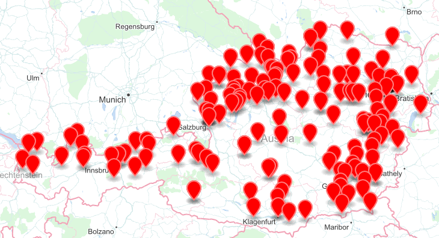

# Beers, Breweries n Brewpubs in Austria (Österreich)

- Ostösterreich [Eastern Austria]
    - [(B) - Burgenland](1--b-burgenland--eastern) - Gols, 
    - [(N) - Niederösterreich [Lower Austria]](1--n-niederoesterreich--eastern)
        - Waldviertel  - Zwettl, Weitra, Schrems
        - Weinviertel  - Laa/Thaya
    - [(W) - Wien [Vienna]](1--w-wien--eastern)
- Südösterreich [Southern Austria]
    - [(K) - Kärnten [Carinthia]](2--k-kaernten--southern)
    - [(ST) - Steiermark [Styria]](2--st-steiermark--southern)
- Westösterreich [Western Austria]
    - [(O) - Oberösterreich [Upper Austria]](3--o-oberoesterreich--western)
        - Innviertel  - Schärding, Ried i. Innkreis, Grieskirchen, Altheim, Eggelsberg, Uttendorf, Engelhartszell
        - Mühlviertel  - Freistadt, Schlägl, St. Martin i. Mühlkreis
        - Salzkammergut
    - [(S) - Salzburg](3--s-salzburg--western)  - Obertrum
    - [(T) - Tirol](3--t-tirol--western) [Tyrol] - Zell am Ziller, St. Johann, Lienz
    - [(V) - Vorarlberg](3--v-vorarlberg--western) -  Bludenz, Dornbirn, Egg

Free open public domain beer, brewery n brewpub data for Austria / Europe. Example:

~~~
_______________________________
- Ottakringer Brauerei | Wien

Ottakringer Helles,                  5.2 %, 11.8°
Ottakringer Gold Fassl Spezial,      5.6 %, 12.7°
Ottakringer (Gold Fassl) Pils,       4.6 %, 11.2°
Ottakringer (Gold Fassl) Pur {Bio},  5.2 %, 11.8°, bio
Ottakringer (Gold Fassl) Zwickl,     5.2 %, 12.2°
Ottakringer (Gold Fassl) Zwickl Rot, 5.2 %, 12.2°
Ottakringer (Gold Fassl) Dunkles,    5.2 %, 12.2°
Ottakringer (Gold Fassl) Bock,       7.6 %, 17.0°
Ottakringer Wiener Original

_________________________________________
- Stieglbrauerei zu Salzburg | Salzburg

Stiegl Goldbräu,            4.9%, 12°,   maerzen
Stiegl Pils,                4.9%, 11.6°
Stiegl Paracelsus Zwickl,   5.0%, 12.0°
Stiegl Weisse

____________________________________________
- Augustiner Bräu Kloster Mülln | Salzburg

Augustiner Märzen,  4.6%,  12°
Augustiner Bock,    6.5%,  16.5°

...
~~~

More at the [Open Beer, Brewery n Brewpub Data (`beer.db`) Project Site »](http://openbeer.github.io)

## Mid-size (m), Large (l) Brewery Definitions

NOTE:

- Large     => 500_000+ hl
- Mid-size  => < 500_000 hl

## Build Your Own `austria.db` Copy

Use the `beerdb` command line tool to build your own `austria.db` copy
from the plain text data sets. [More »](https://github.com/openbeer/build)

### Examples

Build the database for all Austrian beers, breweries n brewpubs:

    $ rake build DATA=at

## Real World Usage

- [The Free World Beer Book › Austria](http://openbeer.github.io/book/at.html)

## Real World Slideshow (Brewery n Beer Fotos)

- [Ottakringer Braukultur-Wochen](https://plus.google.com/photos/100841117019192894371/albums/6038058312732921473) - Ottakringer Brauerei
- [Obertrum, Salzburg Bier Tour](https://plus.google.com/photos/100841117019192894371/albums/6032865116125803521) - Trumer Brauerei, Stiegl Brauwelt, Augustiner Bräu Kloster Mülln
- [St. Martin, Engelhartszell Bier Tour](https://plus.google.com/photos/100841117019192894371/albums/6031387769471953793) - Brauerei Hofstetten, Trappistenbrauerei Stift Engelszell
- [Schärding, Ried i. Innkreis Bier Tour](https://plus.google.com/photos/100841117019192894371/albums/6032848287196199553) - Brauerei Baumgartner, Kellerbräu 
- [Freistadt Bier Tour](https://plus.google.com/photos/100841117019192894371/albums/5920043800128524369) - Freistädter Braucommune

## Questions? Comments?

Send them along to the
[Open Beer, Breweryn n Brewpub Data Forum/Mailing List](http://groups.google.com/group/beerdb).
Thanks!
